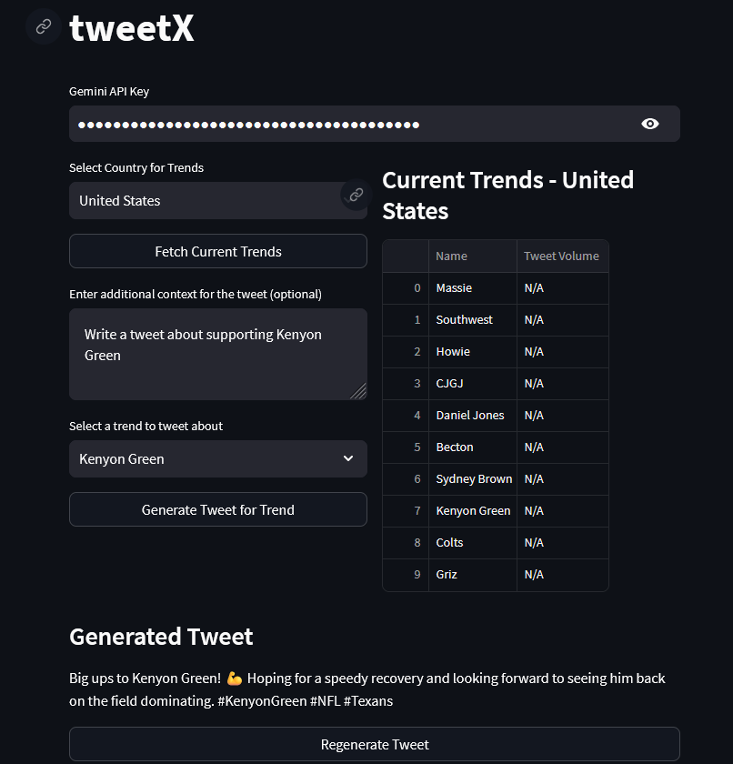

# Automate your Twitter / X account using AI and Trending Topics

Want to create engaging content for Twitter/X but struggling with what to post? This tool helps you generate relevant tweets based on current trending topics using the power of AI. Instead of spending hours brainstorming content ideas, you can:

- See real-time trending topics from different countries
- Select trends that interest you
- Generate AI-powered tweets about those trends
- Customize the tweet generation with your own context
- Regenerate tweets until you find the perfect one

The application uses Streamlit for an easy-to-use interface and Gemini AI to create engaging, contextual tweets based on current trends. Perfect for content creators, social media managers, or anyone looking to maintain an active Twitter/X presence with relevant content.

### Features
- Real-time trending topics from 25+ countries
- AI-powered tweet generation using Google's Gemini 1.5 Pro
- Customizable tweet context
- Tweet volume statistics for trends
- User-friendly interface
- Character limit compliance

### Installation

1. Clone the repository
```bash
git clone https://github.com/krishna-exe/tweetX.git
cd tweetX
```

2. Create a virtual environment
```bash
python -m venv venv
.\venv\Scripts\activate
```

3. Install required packages
```bash
pip install -r requirements.txt
```

4. Set up API keys
- Get a Gemini API key from [Google AI Studio](https://makersuite.google.com/app/apikey)

5. Run the application
```bash
streamlit run app.py
```

The app will open in your default web browser at `http://localhost:8501`

### Usage

1. Enter your Gemini API key in the text input field
2. Select a country to fetch trending topics
3. Click "Fetch Current Trends" to see the latest trends
4. Select a trend from the dropdown menu
5. (Optional) Add custom context for the tweet
6. Click "Generate Tweet for Trend" to create a tweet
7. Use "Regenerate Tweet" if you want a different version


 
